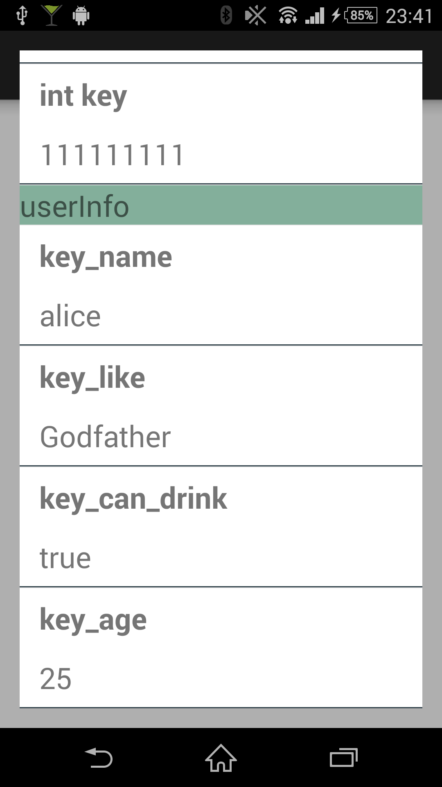
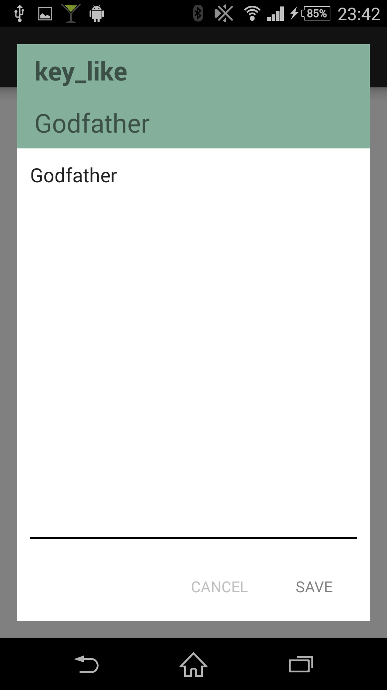

# Cocktail


### Features
- debugging tool to start by shaking
- reading/writing SharedPreferences

 


### Usage
- call `Cocktail.base(this);` in `Application#onCreate()`
- start debugging mode from notification
- shake

```java
public class TargetApplication extends Application {
    @Override
    public void onCreate() {
        super.onCreate();
        // call here when debugging
        Cocktail.base(this);
    }
}
```

### Installation
- Installation with maven

```
coming soon
```

- Copying all the files into your project
- Using submodule


### License
Transporter is released under the MIT license. See LICENSE for details.


